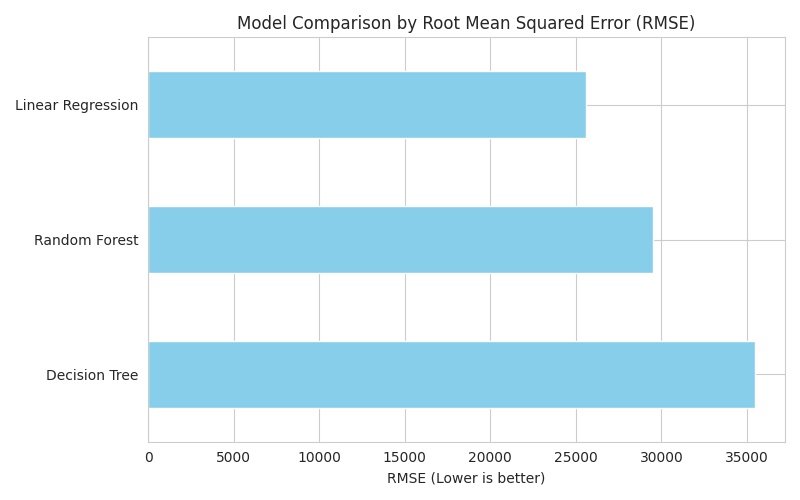
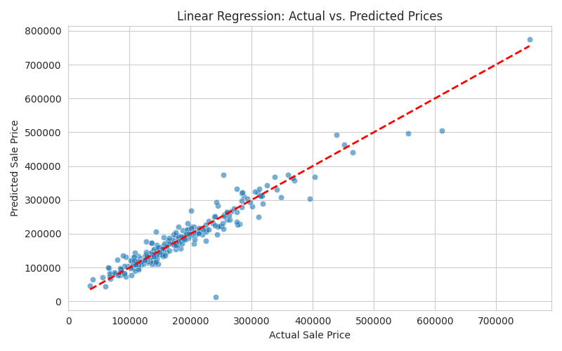

# House Price Prediction Project

### 🏠 Project Overview
This project demonstrates a complete machine learning workflow to predict house prices based on the Ames, Iowa housing dataset. The goal was to prepare the data, perform exploratory data analysis, compare several regression models, and present the results of the best-performing model.

### ⚙️ How to Run the Code
1.  Ensure you have Python and the necessary libraries (`pandas`, `scikit-learn`, `seaborn`, `matplotlib`) installed.
2.  Download the `train.csv` dataset into the same folder.
3.  Run the `house_price_prediction.py` script from your terminal:
    ```bash
    python house_price_prediction.py
    ```
4.  The script will print the model evaluation results and save all plots as `.png` files.

### 📊 Key Findings & Results
After training and evaluating three different models (Linear Regression, Decision Tree, and Random Forest), the **Linear Regression** model was found to be the most effective.

* **Best Model:** Linear Regression
* **R² Score:** 0.9145
* **RMSE:** $25,611.06

This indicates that the model can explain about 91.5% of the variance in house prices and has an average prediction error of approximately $25,611.

### 📈 Visualizations

**Model Performance Comparison:**


**Actual vs. Predicted Prices (Linear Regression):**


